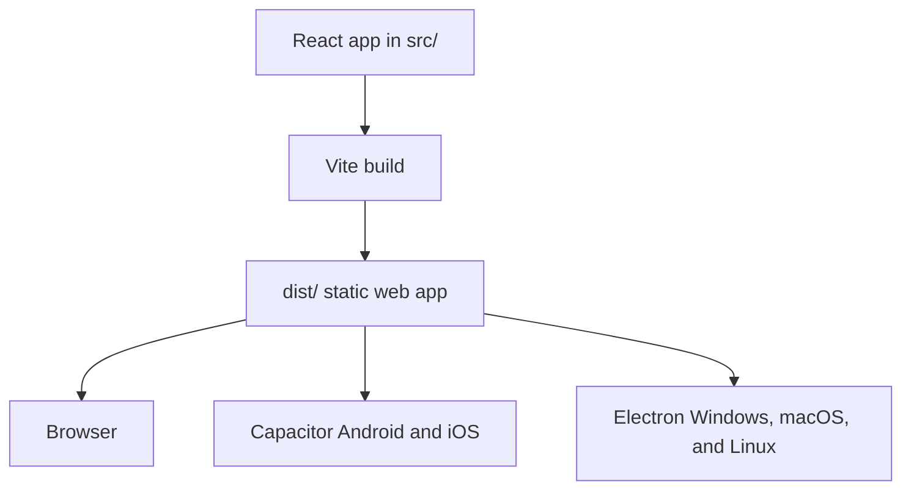

# BigfootDS ReactJS Multiplatform Template

This is a browser-first React template for products that also need desktop and mobile builds. Vite builds the web app, Electron packages it for desktop, and Capacitor syncs the same web output into native mobile projects.

The important bit is that `src/` remains a normal web application. Desktop and mobile code sit at the edges, not inside every component.



## Quick start

```powershell
npm install
npm run react:dev
```

Then open the local URL printed by Vite. Before handing work over, run:

```powershell
npm run react:lint
npm run react:test:e2e
```

The end-to-end command builds the app, starts a production preview on `127.0.0.1:4173`, and runs the Chromium smoke test.

## Common commands

| What you need to do | Command |
| --- | --- |
| Start the browser development server | `npm run react:dev` |
| Build the web app and Electron main/preload bundles | `npm run react:build` |
| Preview the production web build | `npm run react:preview` |
| Run type-aware linting | `npm run react:lint` |
| Generate per-language localisation files | `npm run localisation:split` |
| Run the Playwright browser suite | `npm run react:test:e2e` |
| Open the Playwright test UI | `npm run react:test:e2e:ui` |
| Synchronise and build Android | `npm run capacitor:android:build` |
| Build a Windows portable Electron package | `npm run electron:build:windows:portable` |

## Project layout

| Path | Purpose |
| --- | --- |
| `src/` | Browser-safe React application code. |
| `electron/` | Electron main-process and preload code. |
| `android/` | Capacitor-generated Android project. |
| `public/` | Static web assets. |
| `tests/e2e/` | Playwright end-to-end tests. |
| `documentation/` | Architecture, workflow, and adoption notes. |
| `capacitor.config.ts` | Capacitor application configuration. |
| `electron-builder.json5` | Desktop packaging configuration. |

## Creating a project from this template

Before publishing a real product, replace the template identity in `package.json`, `capacitor.config.ts`, and `electron-builder.json5`. Give the app a real name, package ID, icons, and release output names.

Set up signing outside the repository. Local builds can read from your own environment, while CI should read from repository secrets. The checked-in configuration must never contain a real keystore, password, or production API key.

If you need platform behaviour, read [Platform architecture](documentation/platform-architecture.md) first. It explains where browser, Electron, and Capacitor code belongs.

## Contributor guidance and documentation

[`AGENTS.md`](AGENTS.md) is the working agreement for AI agents and human contributors. It covers architecture boundaries, generated output, verification, and documentation expectations.

The focused guides are:

- [Platform architecture](documentation/platform-architecture.md)
- [Testing](documentation/testing.md)
- [Persistence strategy](documentation/persistence-strategy.md)
- [SQLocal and Kysely settings recipe](documentation/sqlocal-kysely-recipe.md)
- [UI and theming](documentation/ui-and-theming.md)
- [Localisation](documentation/localisation.md)
- [CI and releases](documentation/ci-and-releases.md)
- [Metadata, assets, and optional integrations](documentation/metadata-assets-and-optional-integrations.md)
- [Godmaker dogfooding adoption backlog](documentation/game-godmaker-dogfooding-updates.md)

The backlog is deliberately separate from the guidance. It records unfinished template work as concrete checkbox tasks, rather than treating every useful idea as a mandatory dependency.
